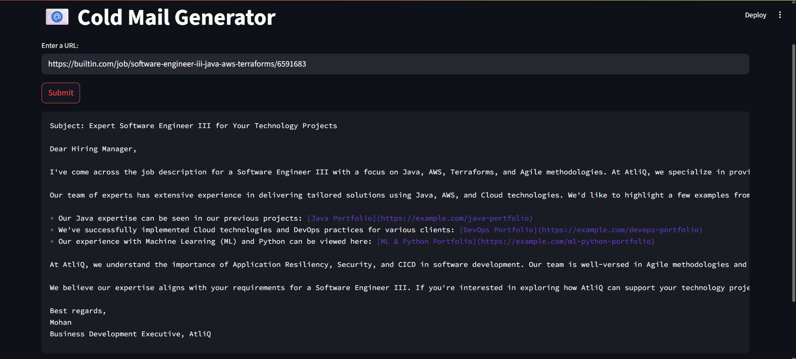
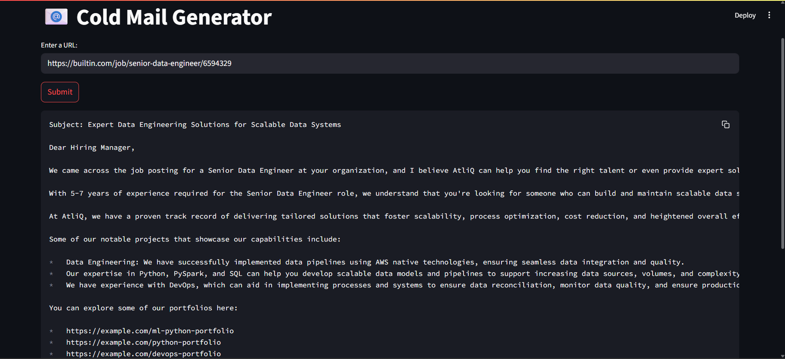
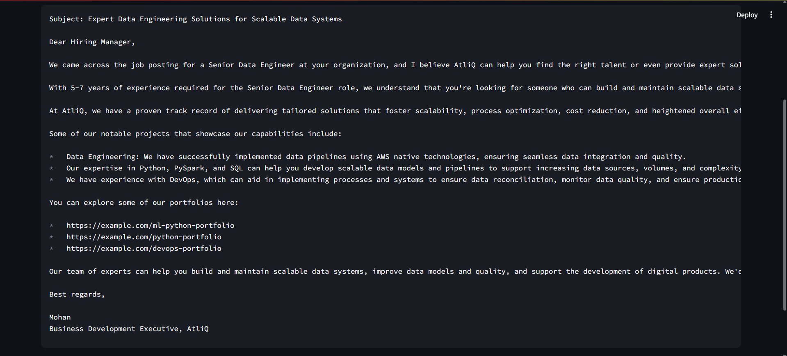

# Cold Email Generator using Gen AI 🧠✉️

This is a Generative AI project that generates personalized cold emails based on website content using LangChain, LLaMA 4 Scout (via ChatGroq API), and Streamlit.

## 🚀 Features

- 🔎 Scrapes content from company websites
- 💡 Uses prompt engineering with LangChain
- ⚡ Fast and cost-effective email generation using `llama-4-scout-17b` on Groq
- 🖼️ Clean and interactive Streamlit interface
- 💬 Generates concise, polite, and personalized cold emails

## 📸 Demo






## 🛠️ Tech Stack

- Python 3.10
- Streamlit
- LangChain
- Groq API (LLaMA 4 Scout)
- Web Scraping (LangChain's WebBaseLoader)

## 📦 Setup Instructions

1. **Clone the repo**
   ```bash
   git clone https://github.com/SairajPatil04/cold-email-generator.git
   cd cold-email-generator

2. Create and activate environment
   ```bash
   conda create -n genai-env python=3.10
   conda activate genai-env

3. Install dependencies
   ```bash
   pip install -r requirements.txt

4. Run the streamlit app:
   ```bash
   streamlit run app/main.py

🔐 API Key
You'll need a Groq API key from https://console.groq.com.
Create a .env file and add:

GROQ_API_KEY=your-api-key-here

## 📄 Credits
Based on the [Codebasics Gen AI Project Series](https://github.com/codebasics/project-genai-cold-email-generator)

## 📬 Contact
Created with ❤️ by [Sairaj Patil](www.linkedin.com/in/sairajpatil1812)
📧 sai18122004@gmail.com
